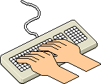

### Hi there 

I'm <b>Pranshi</b>, a self-motivated individual with interest in <b>Technology</b>. I'm an Open-source enthusiast with skills in <b>Python</b>, <b>C</b>, and <b>Frontend Development</b>. I turn <em>coffee into code</em>. 😉

-   I’m currently learning Data Structures and Algorithms.
-  I’m looking to collaborate on various Open-source projects.
-   How to reach me: Shoot me an email at apranshi11@gmail.com
-  Fun fact: I don't always study, sometimes it's just 
